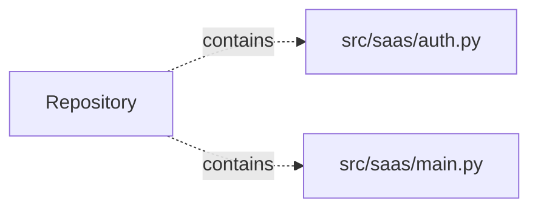

# multi-tenant-saas-platform — project architecture

[README](README.md) · [Interview questions and answers](INTERVIEW_QA.md)

## Purpose and scope

A local authorization server issues single-use codes with PKCE. The token carries the user's tenant and role. Every records call needs `X-Tenant` to match the token, and the role decides what the call may do.

This document describes files and symbols in this checkout. Deployment templates and statements in the original overview are distinguished from a verified running environment.

## Component diagram



For Python repositories, arrows show resolved local imports, not network calls or deployment order. Otherwise the diagram is a repository component map; containment arrows do not assert runtime integration.

## Components and responsibilities

| Component | Responsibility |
| --- | --- |
| [`src/saas/main.py`](src/saas/main.py) | HTTP handlers: `GET /healthz`, `GET /oauth/authorize`, `POST /oauth/token`, `GET /me`, `GET /records` |
| [`src/saas/auth.py`](src/saas/auth.py) | Functions: `challenge_for`, `authorize`, `exchange`, `issue`, `decode`, `require`, `__init__` |
| [`requirements.txt`](requirements.txt) | Implementation or supporting configuration |
| [`web/src/App.tsx`](web/src/App.tsx) | User interface code/assets |
| [`Dockerfile`](Dockerfile) | Container build/service configuration |
| [`docker-compose.yml`](docker-compose.yml) | Container build/service configuration |
| [`tests/test_saas.py`](tests/test_saas.py) | Executable checks and regression examples |
| [`.github/workflows/ci.yml`](.github/workflows/ci.yml) | GitHub Actions job definitions |
| [`README.md`](README.md) | Project explanations or operating notes |

## Request interface

| Method and path | Handler | Source |
| --- | --- | --- |
| `GET /healthz` | `healthz` | [`src/saas/main.py`](src/saas/main.py#L69) |
| `GET /oauth/authorize` | `authorize` | [`src/saas/main.py`](src/saas/main.py#L74) |
| `POST /oauth/token` | `token` | [`src/saas/main.py`](src/saas/main.py#L80) |
| `GET /me` | `me` | [`src/saas/main.py`](src/saas/main.py#L86) |
| `GET /records` | `records` | [`src/saas/main.py`](src/saas/main.py#L92) |
| `POST /records` | `create_record` | [`src/saas/main.py`](src/saas/main.py#L98) |
| `DELETE /records/{record_id}` | `delete_record` | [`src/saas/main.py`](src/saas/main.py#L107) |
| `GET /audit` | `audit` | [`src/saas/main.py`](src/saas/main.py#L118) |

The table lists literal route decorators found in the inspected Python modules. Router prefixes and middleware can add behavior; check the linked handler and application setup before calling an endpoint.

## Implementation walkthrough

### `exchange(grant_type, code, client_id, redirect_uri, code_verifier)`

Source: [`src/saas/auth.py`](src/saas/auth.py#L52).

Calls visible in this function: `AuthError`, `CODES.pop`, `challenge_for`, `issue`, `time.time`.

```python
def exchange(grant_type, code, client_id, redirect_uri, code_verifier):
    if grant_type != "authorization_code" or client_id != CLIENT_ID:
        raise AuthError("unsupported grant", 422)
    grant = CODES.pop(code, None)
    if grant is None:
        raise AuthError("unknown or already used code")
    if grant["expires"] < time.time():
        raise AuthError("code expired")
    if grant["redirect_uri"] != redirect_uri:
        raise AuthError("redirect_uri does not match the authorize request")
    if challenge_for(code_verifier) != grant["challenge"]:
        raise AuthError("code_verifier does not match the challenge")
    identity = USERS[grant["user"]]
    claims = {"sub": grant["user"], "tenant": identity["tenant"], "role": identity["role"]}
    return issue(claims)
```

### `authorize(client_id, redirect_uri, user, code_challenge, method='S256')`

Source: [`src/saas/auth.py`](src/saas/auth.py#L38).

Calls visible in this function: `AuthError`, `secrets.token_urlsafe`, `time.time`.

```python
def authorize(client_id, redirect_uri, user, code_challenge, method="S256"):
    if client_id != CLIENT_ID:
        raise AuthError("unknown client", 422)
    if redirect_uri != REDIRECT_URI:
        raise AuthError("redirect_uri is not registered", 422)
    if user not in USERS:
        raise AuthError("unknown user", 422)
    if method != "S256" or not code_challenge:
        raise AuthError("PKCE with S256 is required", 422)
    code = secrets.token_urlsafe(24)
    CODES[code] = {"user": user, "challenge": code_challenge, "redirect_uri": redirect_uri, "expires": time.time() + CODE_SECONDS}
    return code
```

### `seed()`

Source: [`src/saas/main.py`](src/saas/main.py#L13).

Calls visible in this function: `AUDIT.clear`, `RECORDS.clear`, `RECORDS.extend`, `auth.CODES.clear`.

```python
def seed():
    RECORDS.clear()
    AUDIT.clear()
    auth.CODES.clear()
    RECORDS.extend(
        [
            {"id": "rec-1", "tenant": "north", "title": "north note", "created_by": "grace"},
            {"id": "rec-2", "tenant": "south", "title": "south note", "created_by": "linus"},
        ]
    )
```

### `record_event(claims, action, record_id)`

Source: [`src/saas/main.py`](src/saas/main.py#L47).

Calls visible in this function: `AUDIT.append`, `datetime.now`, `datetime.now(timezone.utc).isoformat`.

```python
def record_event(claims, action, record_id):
    AUDIT.append(
        {
            "tenant": claims["tenant"],
            "actor": claims["sub"],
            "action": action,
            "record": record_id,
            "at": datetime.now(timezone.utc).isoformat(),
        }
    )
```

## Validation and failure paths

| Explicit exception | Source |
| --- | --- |
| `AuthError('unknown client', 422)` | [`src/saas/auth.py`](src/saas/auth.py#L40) |
| `AuthError('redirect_uri is not registered', 422)` | [`src/saas/auth.py`](src/saas/auth.py#L42) |
| `AuthError('unknown user', 422)` | [`src/saas/auth.py`](src/saas/auth.py#L44) |
| `AuthError('PKCE with S256 is required', 422)` | [`src/saas/auth.py`](src/saas/auth.py#L46) |
| `AuthError('unsupported grant', 422)` | [`src/saas/auth.py`](src/saas/auth.py#L54) |
| `AuthError('unknown or already used code')` | [`src/saas/auth.py`](src/saas/auth.py#L57) |
| `AuthError('code expired')` | [`src/saas/auth.py`](src/saas/auth.py#L59) |
| `AuthError('redirect_uri does not match the authorize request')` | [`src/saas/auth.py`](src/saas/auth.py#L61) |
| `AuthError('code_verifier does not match the challenge')` | [`src/saas/auth.py`](src/saas/auth.py#L63) |
| `AuthError('bearer token required')` | [`src/saas/auth.py`](src/saas/auth.py#L76) |
| `AuthError('token tenant does not match X-Tenant', 403)` | [`src/saas/auth.py`](src/saas/auth.py#L85) |
| `AuthError(f"{claims['role']} cannot {permission}", 403)` | [`src/saas/auth.py`](src/saas/auth.py#L87) |
| `AuthError('invalid token')` | [`src/saas/auth.py`](src/saas/auth.py#L80) |
| `HTTPException(status_code=404, detail='record not found')` | [`src/saas/main.py`](src/saas/main.py#L114) |
| `HTTPException(status_code=exc.status, detail=str(exc))` | [`src/saas/main.py`](src/saas/main.py#L44) |

These are explicit exceptions in the inspected source, rather than a claim that every failure is handled. Follow the calling handler to see whether the exception becomes an HTTP response or propagates.

## Data and state

- [`src/saas/auth.py`](src/saas/auth.py) defines module-level containers: `USERS`, `PERMISSIONS`, `CODES`.
- [`src/saas/main.py`](src/saas/main.py) defines module-level containers: `RECORDS`, `AUDIT`.

Module-level dictionaries/lists live in a Python process. They can be fixtures or mutable state; inspect writes before treating them as persistent storage. A production extension would need to define persistence and concurrency behavior explicitly.

## Data flow and design decisions

### What is the input-to-output contract of `exchange`

In [`src/saas/auth.py`](src/saas/auth.py#L52), `exchange(grant_type, code, client_id, redirect_uri, code_verifier)` receives the inputs. The function computes these intermediate values:

- `grant = CODES.pop(code, None)`
- `identity = USERS[grant['user']]`
- `claims = {'sub': grant['user'], 'tenant': identity['tenant'], 'role': identity['role']}`

Its result is defined by:

- `issue(claims)`

### Which decision rules or boundary conditions should an interviewer challenge

The implementation in [`src/saas/auth.py`](src/saas/auth.py#L52) branches on:

- `grant_type != 'authorization_code' or client_id != CLIENT_ID`
- `grant is None`
- `grant['expires'] < time.time()`
- `grant['redirect_uri'] != redirect_uri`
- `challenge_for(code_verifier) != grant['challenge']`

A useful extension is a table-driven test that covers each condition just below, at, and above its boundary where applicable. These expressions are the current rules; changing them changes behavior and should be justified by the project’s acceptance criteria.

### What does `web/src/App.tsx` own

[`web/src/App.tsx`](web/src/App.tsx) defines `App`, `headers`, `load`, `create`. Its imports include `react`.

Trace these definitions and imports to explain the module boundary. Relative imports identify project code; package imports should be checked against the nearest manifest.

## Setup and verification

The following commands are derived from the checked-in dependency/test contracts. Execute them from the repository root; the block prepares a local environment, not a cloud deployment.

```bash
python3 -m venv .venv
source .venv/bin/activate
python -m pip install -r requirements.txt
python -m pytest -q
```

Python dependencies: [`requirements.txt`](requirements.txt).

Test entry points: [`tests/test_saas.py`](tests/test_saas.py).

Automation definitions: [`.github/workflows/ci.yml`](.github/workflows/ci.yml). Read their triggers and job steps to determine what CI actually runs.

## Operating boundaries and design review

Before turning this checkout into a customer deployment, establish the input contract, data ownership, access controls, failure response, evaluation criteria, and rollback owner. Repository fixtures and unit tests demonstrate local behavior; they do not establish throughput, uptime, compliance, or business impact.

A useful architecture review starts with the linked implementation: identify where input enters, where a decision is made, which state can change, and which external dependency can fail. Add a deployment view only for infrastructure that is actually configured and exercised.
